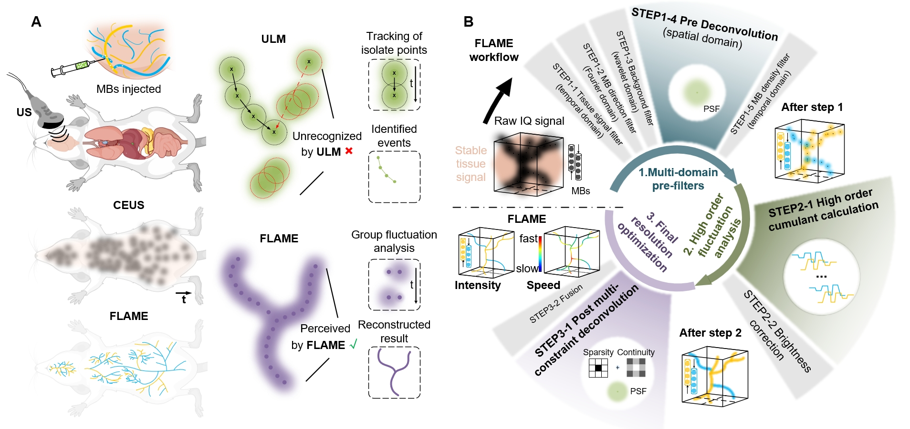
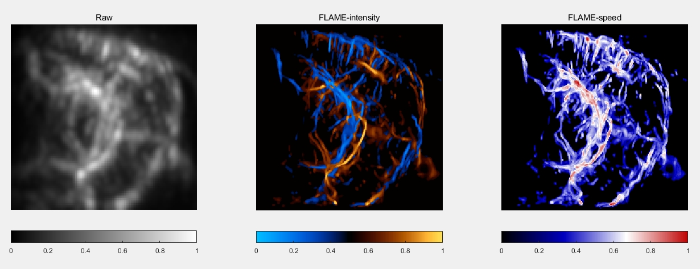

<p>
<h1 align="center">FLAME<font color="#FF6600">m</font></h1>
<h5 align="center">FLuctuation-based high-order super-resolution Acoustic MicroscopE</h5>
<h5 align="center">FLAME reconstruction with MATLAB</h5>
</p>


This repository is for our developed FLuctuation-based high-order super-resolution Acoustic MicroscopE (FLAME), and it will be in continued development. It is distributed as accompanying software for publication: Weisong Zhao et al. High-throughput 3D super-resolution ultrasound imaging,  Nature, submitted (2025). Please cite FLAME in your publications, if it helps your research.


## FLAME reconstruction

<p align='center'>

</p>


## Instruction

Load the target mat file using load and change the variable name to input. The FLAME reconstruction requires some parameters. 

<h5>Necessary Parameters</h5>

Important parameters that must be set according to actual needs.

`SVD_option`  Enable SVD filtering. *{default: 0}*

`MB_option` Enable MB (multi-band) direction filtering. *{default: 0}*

`pixel` Pixel size of input data (µm). *{default: 60}*

`fidelity` Sparsity reconstruction fidelity (controls data fidelity term weight). *{default: 200}*

`sparsity` Sparsity reconstruction strength (controls sparsity term weight). *{default: 10}*

`FWHM2` Full-width half-maximum (FWHM) of post-deconvolution kernel (µm). *{default: 240}*

`iter2`Number of post-deconvolution iterations. {default: 15}

<h5>Expert parameters</h5>

Some adjustable parameters that can optimize the reconstruction results.

`Stab_option` Remove unstable frames (e.g., due to breathing/heartbeat). *{default: 1}*

`cutoff1` Low threshold for SVD filtering (range: 0–1). *{default: 0.25}*

`cutoff2`  High threshold for SVD filtering (range: 0–1). *{default: 0.8}*

`BF_option1` Enable additional background filtering. Note: Significantly reduces speed. *{default: 0}*

`finter1` First upsampling factor. Tips: Improves quality but reduces speed/increases memory. 

​                 Increase only with proportional reduction in fidelity/sparsity. *{default: 2}*

`FWHM1` FWHM of pre-deconvolution kernel (µm).  *{default: 180}*

`iter1` Number of pre-deconvolution iterations. *{default: 10}*

`hawk_option` Enable HAWK processing. Note: Improves quality but increases memory usage. *{default: 0}*

`order` Autocorrelation order. 

​             Tips: Higher values improve resolution but reduce image continuity/linearity. *{default: 6}*

`finter2` Second upsampling factor. *{default: 2}*

`fidelity_z` Z-axis fidelity weight. Use 1 for isotropic data. *{default: 1}*

`BF_option2` Secondary background filtering. Note: Significantly reduces speed. *{default: 0}*


Here are 4 examples:

```
[output_CEUS, output_deconv_n, output_deconv_p] = FLAME(input,'pixel',60,'FWHM2',330);
[output_CEUS, output_deconv_n, output_deconv_p] = FLAME(input,'MB_option',1,'fidelity',10,'sparsity',1);
[output_CEUS, output_deconv_n, output_deconv_p] = FLAME(input,'SVD_option',1,'MB_option',1,'cutoff1',0.1,'cutoff2',0.9);
[output_CEUS, output_deconv_n, output_deconv_p] = FLAME(input,'iter1',5,'iter2',30);
```

## Fusion

Generate better quality intensity and flow velocity images using 4 ultra fast SR frames.

```
for k = 1:floor(size(data,4)/120)
[intensity_n, intensity_p, speed] = fusion(SR_volume_n(:,:,:,(k-1)*4+1:(k-1)*4+4),SR_volume_p(:,:,:,(k-1)*4+1:(k-1)*4+4));
end
```

Rolling fusion can also be chosen to obtain fusion results with higher temporal resolution.

```
for k = 1:floor(size(data,4)/30)-3
[intensity_n, intensity_p, speed] = fusion(SR_volume_n(:,:,:,k:k+3),SR_volume_p(:,:,:,k:k+3));
end
```

## Visualization

Use FLAME's specially designed color encoding to render the final result.

```
rendering(intensity_n, intensity_p, speed, output_CEUS,'MB_option',1);
```

<p align='center'>

</p>

You can also export a mat file containing the results and render it using other software.

## Declaration

This repository contains the MATLAB source code for **FLAME**.

## Open source [FLAMEm](https://github.com/SR-Wiki/FLAMEm)

This software and corresponding methods can only be used for **non-commercial** use, and they are under Open Data Commons Open Database License v1.0.

